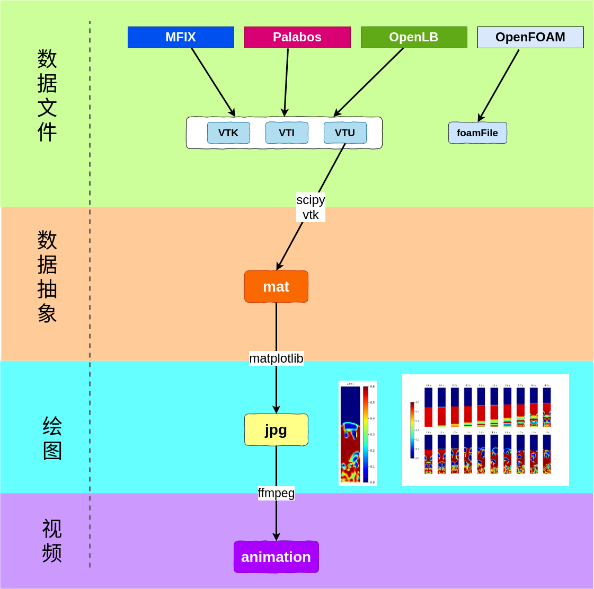

## 软件基本信息

+ name: vivi
+ version: 1.0
+ author: wuyao
+ email: wuyao1997@qq.com
+ license: GPL
+ language: python
+ depandency:
    1. vtk
    2. matplotlib
    3. scipy
    4. numpy
    5. ffmpeg
+ 现阶段软件的目标和功能是
    1. 针对矩形外形的
    2. 均匀结构网格
    3. 绘制云图和动画

## 软件现有框架



## 下一步发展
1. 输入文件接口增广: foam2mat, vti2mat, vtk2mat
2. 矢量图：viVector
3. 散点图: viScatter
4. 添加等高线:
5. 流化床固含率的轴向径、向分布以及拼接
6. 非均匀网格
7. 非结构、非矩形外形
8. 智能管理

## Install(Ubuntu)

### step1: install miniconda ( or conda )

### step2: create virtual enviroment

### step3: install depandency

1. vtk
2. matplotlib
3. scipy
4. numpy
5. ffmpeg

### step4: add path to python script

In your `./bashrc` which located in your home directory, add content below

```shell
export PATH="path to python script:$PATH"

# eg: export PATH="/home/wuyao/tool:$PATH"
```

### step5： modify the python interpreter 

modify the python interpreter which located at first line in script file,

By default, it's 

```python
#!/home/wuyao/miniconda3/envs/wython/bin/python
```

### step6: copy the file vivi1.json and vivi1-note.json to your template directory


## 软件使用

1. 创建vivi1.json文件，并按要求填写内容
2. 执行脚本，即可得到处理结果

## vivi1.json

### base

+ absolutePath：处理文件的绝对路径，未测试中文路径
+ filePrefix：处理文件名的前缀，批量文件名往往是`prefix+time+extension`，如`abc_0010.vtu`，这里文件前缀就是`abc_`
+ serialLength：时间序列的长度，如`abc0010.vtu`中时间长度就是4
+ meshsize：计算的网格数目，第一个参数是宽，第二个是高
+ fontPath: 字体路径
+ fontsize：字体大小
+ outFormat： 输出图片格式
+ dpi：输出图片精度，300为高精度，要求不高时可选150或100
+ timeUnit： 时间单位
+ timeHigh：时间戳的相对高度
+ axis：`off/on`，是否打开坐标轴
+ override： `true/false`是否覆盖先前的文件，选`false`时会在文件名中添加时间字符串，仅对viTimeCloud可用

### vtu2mat

+ subDirectory：`mat`文件输出的子目录
+ indexLoop：转换文件的序列，如[0,1,5]表示从第0个到第5个（含）文件将被转换，1表示跳跃文件数
+ keyLoop：转换的物理量，其值与软件导出时的设置有关

### key

+ name: 物理量的值
+ dimension： 物理量维度，标量是1，速度是3
+ epg2eps：`true/false`，若想使用空气浓度得到颗粒浓度，需要指定为`true`

### colorBar

+ barLacation: colorbar的位置
+ barMin：为了更好的表示压力，设置的环境压力
+ barMinStr：bar的单位，latex格式书写
+ vmin：bar的起点
+ vmax: bar的终点

### viTimeCloud

+ subDirectory：`mat`文件输出的子目录
+ figsize: 输出图片尺寸
+ plotRowCol：图片行列
+ indexLoop：图片对应的文件序列
+ timeInterval：两张图片间的时间间隔
+ timeStart：时间起点
+ timeFlag：`true/false`，是否打上时间戳
+ timeStrLength：时间戳的字符串长度

### viCloud

+ subDirectory：`mat`文件输出的子目录
+ figsize: 输出图片尺寸
+ indexLoop：图片对应的文件序列
+ timeInterval：两张图片间的时间间隔
+ timeStart：时间起点
+ timeFlag：`true/false`，是否打上时间戳
+ timeStrLength：时间戳的字符串长度

### viAnimation

直接使用ffmpeg将图片转为mp4格式

+ `-f image2`： 指定图片格式（本选项适用于jpg）
+ `-r 10`：设置帧率为10，可按照需求自己设置
+ `-i ./...`：指定要处理的图片
+ `-vcodec libx264`： 指定编码格式为h.264

（使用ffmpeg将mp4转为gif也非常简单）